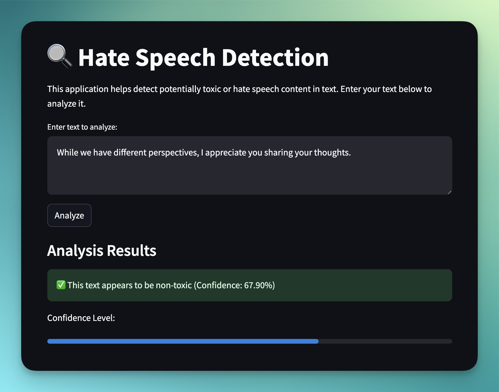
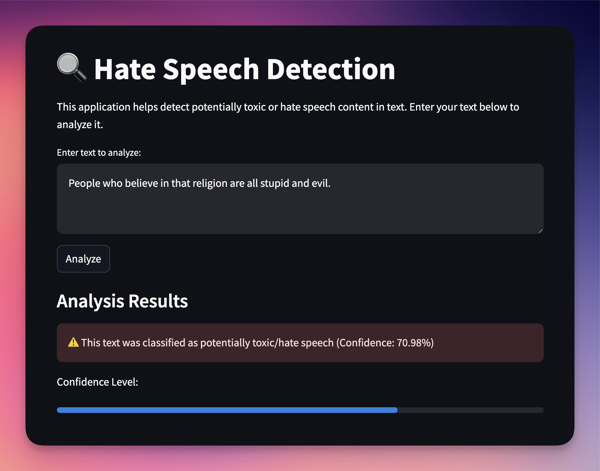
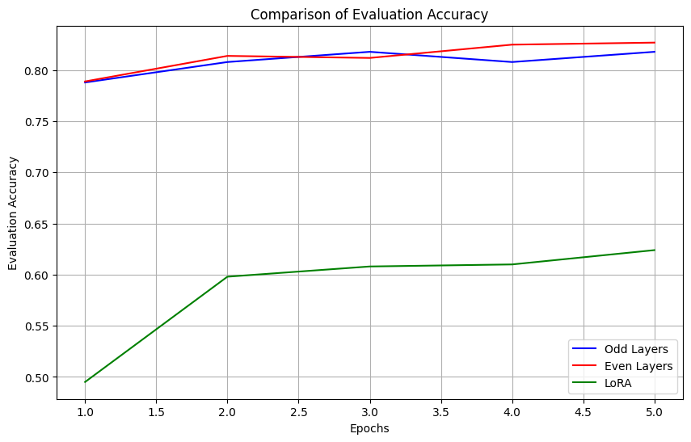

This project analyzes the performance differences between three models: Teacher, Odd/Even Layer, and LoRA using a real-world text classification scenario.

# 👨‍💻 Demo

<!-- [](...) -->




# 📚 Dataset

[](https://huggingface.co/datasets/wisnu001binus/Hate_Speech_Dataset)

The **Hate Speech Dataset** is created by wisnu001binus and designed for hate speech detection and classification tasks.

Dataset Characteristics:
- Source: Hugging Face Datasets (`wisnu001binus/Hate_Speech_Dataset`) 
- Task: Binary classification (Hate Speech Detection)
- Language: English


Key Features:
- Input Column: `Content` - Contains the text to be classified
- Label Column: `Label` - Binary classification (0: Non-hate speech, 1: Hate speech)
- Format: Pre-processed text data suitable for NLP tasks

Data Processing:
- Maximum sequence length: 128 tokens
- Tokenization: Using BERT tokenizer (`bert-base-uncased`)
- Data splits:
  - Training: 10,000 samples (randomly selected)
  - Evaluation: 1,000 samples
  - Test: 1,000 samples

# 📈 Performance Metrics

1. **Parameter Efficiency**:
- Teacher Model: ~109.5M parameters (baseline)
- Odd/Even Layer Models: ~67.0M parameters (61% of teacher)
- LoRA Model: ~296K parameters (0.27% of teacher)
   
2. **Performance Metrics**:

| Model Type | Training Loss | Test Set Accurary |
|------------|:-------------:|:-----------------:|
| Teacher    | 0.1575        | 81.80%            |
| Odd Layer  | 0.1575        | 81.80%            |
| Even Layer | 0.1582        | 82.70%            |
| LoRA       | 0.2383        | 62.40%            |

<div style="display: flex: space-between;">
    
    
</div>


<br/>
Key Observations:

1. **Odd vs Even Layer Models**:
- Very similar performance (difference < 1% accuracy)
- Both achieve ~82% accuracy while using 61% of parameters
- Shows that either odd or even layers can effectively capture model capabilities

2. **LoRA Model**:
- Significantly more parameter-efficient (uses only 0.27% of original parameters)
- Performance trade-off: ~20% lower accuracy than odd/even models
- Higher loss (0.2383 vs ~0.158) indicates less precise predictions

3. **Efficiency-Performance Trade-off**:
- Odd/Even models: Good balance between parameter reduction (39% reduction) and performance maintenance
- LoRA: Extreme parameter efficiency but with notable performance drop
- The choice between them depends on specific requirements (storage constraints vs accuracy needs)

Recommendation:
- If storage/computation is severely constrained: Use LoRA
- If balanced performance/efficiency is needed: Use Odd/Even layer approach
- If maximum accuracy is required: Consider the full teacher model

# 🔧 Challenges and Improvements

### Challenges in Distillation Fine-tuning (Odd/Even Layer)

The implementation of distillation fine-tuning presented several key challenges:

- Complex layer mapping between teacher and student models
- Balancing multiple loss terms effectively
- Managing knowledge transfer across different architectural structures
- Ensuring consistent performance across different layers
- Handling gradient flow through multiple loss components

### Challenges in LoRA Fine-tuning

LoRA implementation faced distinct challenges centered around optimization and configuration:

- Optimal rank selection for different tasks
- Identifying appropriate target modules for adaptation
- Balancing model efficiency with performance
- Managing training stability with reduced parameters
- Adapting to different model architectures

### Proposed Improvements

These sample implementations address the abovementioned core challenges:

1. **Dynamic loss balancing**

    ```python
    # Original Challenge:
    loss = (loss_cls + loss_div + loss_cos) / 3  # Simple averaging

    # Improved Implementation:
    class AdaptiveLossBalancer:
        def __init__(self):
            self.loss_weights = {
                'cls': 1.0,
                'div': 1.0,
                'cos': 1.0
            }
            self.loss_history = []
            
        def compute_weighted_loss(self, outputs, teacher_outputs):
            # Calculate individual losses
            loss_cls = outputs.loss
            loss_div = criterion_div(outputs.logits, teacher_outputs.logits)
            loss_cos = criterion_cos(
                teacher_outputs.logits,
                outputs.logits,
                torch.ones(outputs.logits.size()[0]).to(device)
            )
            
            # Dynamic weight adjustment based on moving averages
            total_loss = (
                self.loss_weights['cls'] * loss_cls +
                self.loss_weights['div'] * loss_div +
                self.loss_weights['cos'] * loss_cos
            )
            
            # Update weights based on loss trends
            self.update_weights([loss_cls, loss_div, loss_cos])
            return total_loss
    ```

2. Adaptive knowledge transfer

    ```python
    class LayerwiseDistillation:
        def __init__(self, teacher_model, student_model):
            self.attention_maps = {}
            self.layer_importance = {}
            
        def compute_layer_attention(self, model_output, layer_idx):
            attention_weights = model_output.attentions[layer_idx]
            return self.normalize_attention(attention_weights)
            
        def transfer_knowledge(self, teacher_layers, student_layers):
            for student_idx, teacher_idx in self.get_layer_mapping():
                # Compute attention similarity
                teacher_attention = self.compute_layer_attention(
                    teacher_layers[teacher_idx], teacher_idx)
                student_attention = self.compute_layer_attention(
                    student_layers[student_idx], student_idx)
                
                # Adjust knowledge transfer based on attention similarity
                transfer_weight = self.calculate_transfer_weight(
                    teacher_attention, student_attention)
                
                self.layer_importance[student_idx] = transfer_weight
    ```

3. Rank optimization

    ```python
    class AdaptiveRankManager:
        def __init__(self, initial_rank=8, max_rank=32):
            self.current_rank = initial_rank
            self.max_rank = max_rank
            self.performance_history = []
        
        def update_rank(self, model, current_loss):
            # Monitor performance trend
            self.performance_history.append(current_loss)
        
            if len(self.performance_history) >= 3:
                if self.is_performance_plateauing():
                    new_rank = min(self.current_rank * 2, self.max_rank)
                    self.adjust_model_rank(model, new_rank)
                
        def adjust_model_rank(self, model, new_rank):
            # Implement rank adjustment logic
            for name, module in model.named_modules():
                if isinstance(module, LoRALayer):
                    module.update_rank(new_rank)
    ```

4. **Training stability**

    ```python
    class HybridTrainer:
        def __init__(self, config):
            self.loss_balancer = AdaptiveLossBalancer()
            self.layer_distillation = LayerwiseDistillation(
                config.teacher_model, config.student_model)
            self.rank_manager = AdaptiveRankManager()
            
        def training_step(self, batch):
            # Phase 1: LoRA adaptation
            lora_outputs = self.forward_lora(batch)
            lora_loss = self.rank_manager.compute_loss(lora_outputs)
            
            # Phase 2: Distillation
            teacher_outputs = self.forward_teacher(batch)
            student_outputs = self.forward_student(batch)
            
            # Combine losses with adaptive weights
            distill_loss = self.loss_balancer.compute_weighted_loss(
                student_outputs, teacher_outputs)
            
            # Update both components
            total_loss = self.combine_losses(lora_loss, distill_loss)
            return total_loss
        
        def training_epoch(self, dataloader):
            for batch in dataloader:
                loss = self.training_step(batch)
                self.rank_manager.update_rank(self.model, loss)
                self.layer_distillation.update_importance()
                self.optimizer.step()
    ```

5. **Performance monitoring**

    ```python
    class PerformanceMonitor:
        def __init__(self):
            self.metrics = {
                'loss': [],
                'accuracy': [],
                'rank_history': [],
                'layer_performance': {}
            }
            
        def update_metrics(self, epoch_results):
            # Track various performance indicators
            self.metrics['loss'].append(epoch_results['loss'])
            self.metrics['accuracy'].append(epoch_results['accuracy'])
            
            # Analyze layer-wise performance
            for layer_idx, perf in epoch_results['layer_metrics'].items():
                if layer_idx not in self.metrics['layer_performance']:
                    self.metrics['layer_performance'][layer_idx] = []
                self.metrics['layer_performance'][layer_idx].append(perf)
            
        def should_adjust_strategy(self):
            # Implement decision logic for strategy adjustment
            return self.detect_performance_plateau() or self.detect_instability()
    ```

# 🙏 Acknowledgements
- Professor Chaklam Silpasuwanchai (Asian Institute of Technology)
- Todsavad Tangtortan (Asian Institute of Technology)
